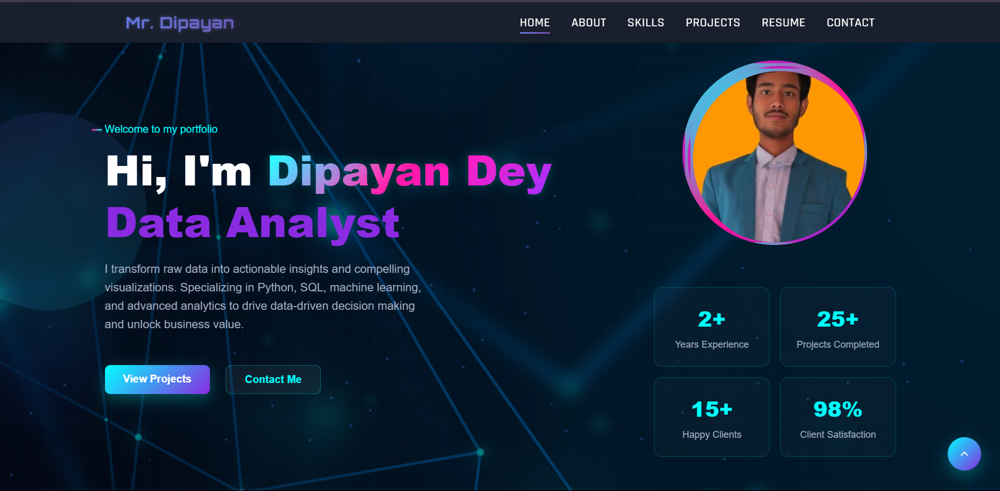

# Dipayan Dey's Portfolio

Welcome to my portfolio! I am a Data Analyst with expertise in Python, SQL, and data visualization. Below, you'll find some of the projects and skills I have worked on. Feel free to browse through the repository to learn more.

## About Me

I am passionate about solving real-world problems using data. My background in computer science and technology, coupled with my hands-on experience, drives me to build meaningful and efficient data-driven solutions.

### Skills:
- **Data Analysis**: Python, Pandas, NumPy, Matplotlib, Seaborn
- **Database Management**: SQL, MySQL
- **Web Development**: HTML, CSS, JavaScript
- **Operating Systems**: Linux, Windows

## Projects

### 1. Forest Monitoring System
- **Objective**: A system to help in monitoring deforestation through satellite data.
- **Technologies Used**: Python, Machine Learning, Data Analysis

### 2. Customer Churn Analysis
- **Objective**: Analyzing telecom customer churn data using EDA.
- **Technologies Used**: Python, Pandas, Seaborn, Matplotlib

### 3. Music Player
- **Objective**: A web-based music player with features like search and filtering.
- **Technologies Used**: HTML, CSS, JavaScript

## Contact Information

- **Email**: dipayandey49@gmail.com
- **Phone**: 8389806944
- **LinkedIn**: https://www.linkedin.com/in/dipayan-dey-033b38309/
- **GitHub**: https://github.com/Mr-Dipayan-Dey

Feel free to explore the projects listed above and reach out to me for collaboration or questions.
